# Diagramas de casos de uso — Sprint 2

Este documento representa los casos de uso definidos en `planing.md`. Cada diagrama conserva los actores y el entorno indicados en esa fuente; no se agregan relaciones `include` o `extend` porque no están especificadas.

## CU1 — Registrar Cliente

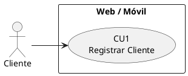

## CU6 — Gestionar Temporadas y Colecciones

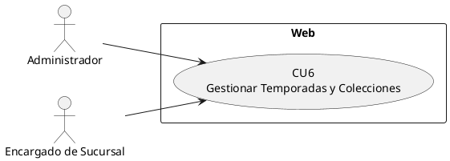

## CU10 — Consultar Catálogo Multicanal

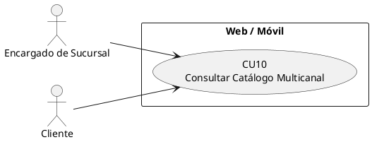

## CU12 — Registrar Reserva de Prendas

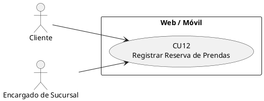

## CU13 — Consultar y Cancelar Reservas

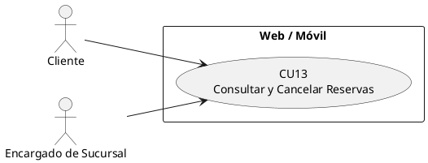

## CU14 — Recepcionar y Preparar Reserva

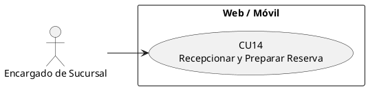

## CU15 — Confirmar Recepción/Atención de Cliente

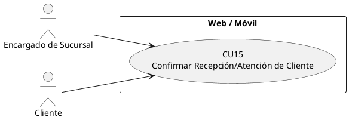

## CU17 — Realizar Compra Digital (Web/Móvil)

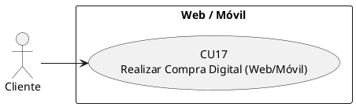

## CU18 — Procesar Pago Electrónico

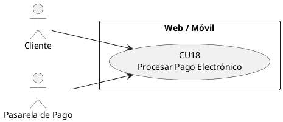

## CU19 — Registrar Venta Presencial (POS)

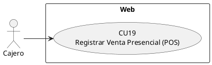

## CU20 — Procesar Pago en Caja y Emitir Comprobante

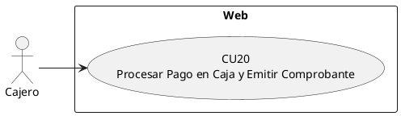

## CU21 — Actualizar Inventario Automáticamente

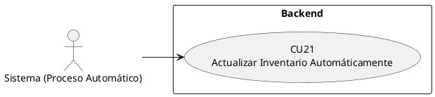
