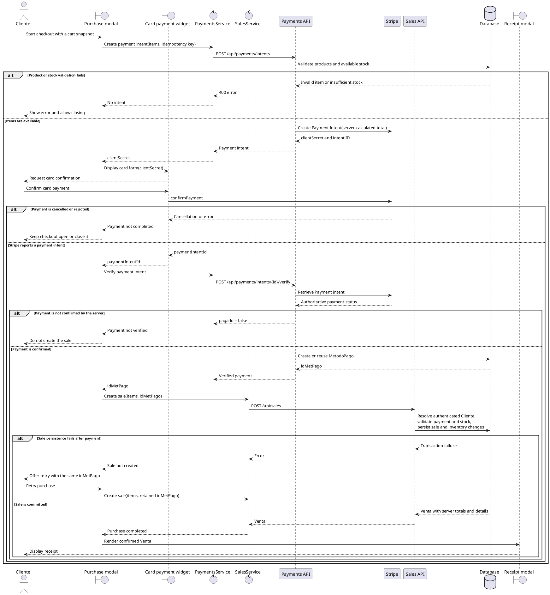
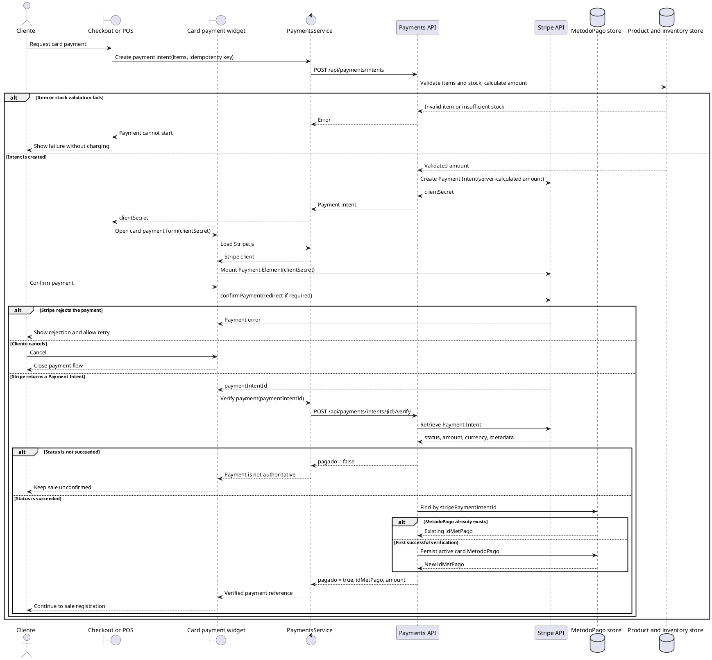
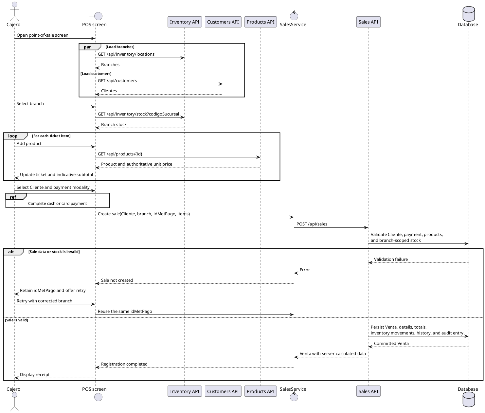
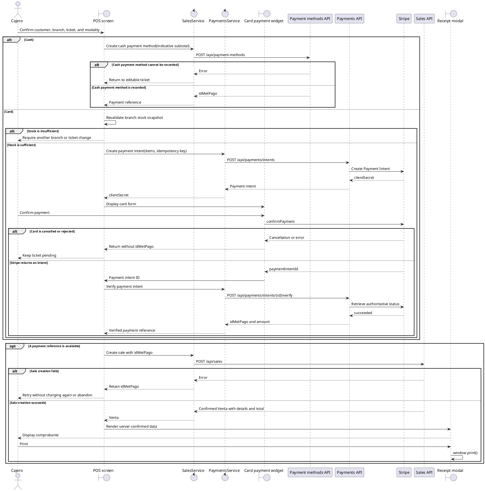
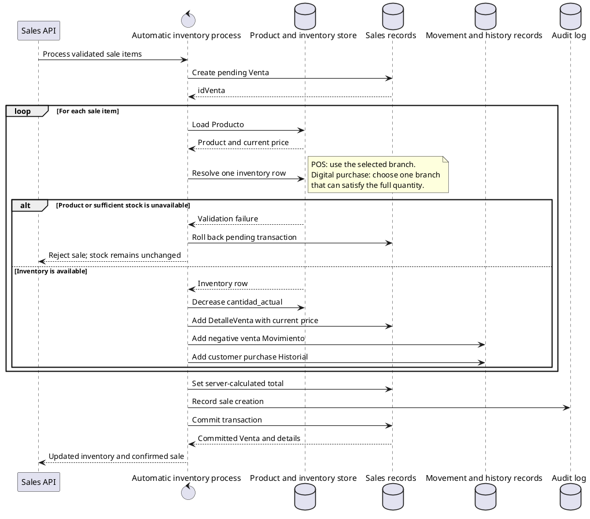

# Sequence diagrams

The following diagrams describe the implemented purchase, payment, point-of-sale, receipt, and automatic inventory flows. HTML comments preserve traceability without adding use-case identifiers or names to rendered diagram titles.

<!-- CU17 -->

<!-- CU18 -->

<!-- CU19 -->

<!-- CU20 -->

<!-- CU21 -->

